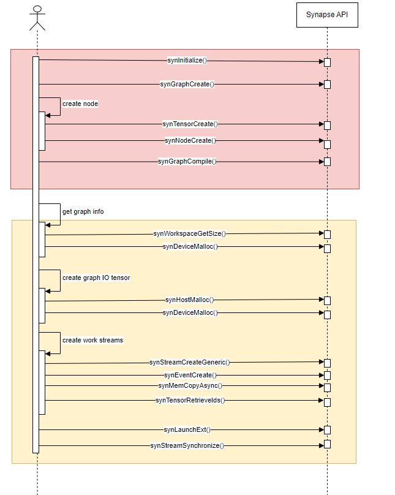

# Synapse C++ API

<!-- @import "[TOC]" {cmd="toc" depthFrom=1 depthTo=6 orderedList=false} -->

<!-- code_chunk_output -->

- [Synapse C++ API](#synapse-c-api)
  - [header files](#header-files)
  - [so files](#so-files)
  - [APIs](#apis)
    - [Initialization](#initialization)
    - [Build Graph](#build-graph)
      - [Create Graph](#create-graph)
      - [Create Tensor](#create-tensor)
      - [Create Node](#create-node)
      - [Compilation](#compilation)
      - [Serialize and DeSerialize](#serialize-and-deserialize)
    - [Runtime](#runtime)
      - [Acquire Device](#acquire-device)
    - [Profiling](#profiling)
    - [Error Code(synStatus)](#error-codesynstatus)
  - [Debug](#debug)
    - [logging](#logging)
    - [Dump Graphs](#dump-graphs)

<!-- /code_chunk_output -->

## header files

located in `/usr/include/habanalabs`

```bash
.
|-- hccl.h
|-- hccl_types.h
|-- hlml.h
|-- hlthunk.h
|-- hlthunk_err_inject.h
|-- hlthunk_tests.h
|-- perf_lib_layer_params.h
|-- shim_default_plugins.hpp
|-- syn_sl_api.h
|-- synapse_api.h
|-- synapse_api_types.h
|-- synapse_common_types.h
|-- synapse_common_types.hpp
|-- synapse_types.h

```

## so files

```bash
.
|-- libComplexGuid.so
|-- libSynapse.so
|-- libSynapseMme.so
|-- libSynapse_profiler.so
|-- libTPCFuser.so
|-- libTpcElfReader.so
|-- libaeon.so.1 -> libaeon.so.1.3.2
|-- libaeon.so.1.3.2
|-- libg1hcl.so
|-- libhccl_ofi_wrapper.so
|-- libhcl.so
|-- libhl-thunk-err_injection.so
|-- libhl-thunk-tests.so
|-- libhl-thunk.so
|-- libhl_gcfg.so
|-- libhl_logger.so
|-- libhl_shim.so
|-- libhl_shim_sdk.so
|-- libhl_sqlite.so
|-- libhlml.a
|-- libhlml.so
|-- libhvldec.so
|-- libhvlmedia.so
|-- libmedia.so
|-- libscal.so
|-- libswtools_sdk.so
|-- libsynapse_utils.so
|-- libsynprof_parser_lib.so
|-- libtpcOpsValidation.so
|-- libtpc_kernels.so
|-- libtpcsim_shared.so
|-- media_numpy_reader.cpython-310-x86_64-linux-gnu.so
|-- media_pipe_api.cpython-310-x86_64-linux-gnu.so
|-- media_pipe_nodes.cpython-310-x86_64-linux-gnu.so
|-- media_pipe_params.cpython-310-x86_64-linux-gnu.so
|-- media_pipe_proxy.cpython-310-x86_64-linux-gnu.so
|-- media_pipe_randomizer.cpython-310-x86_64-linux-gnu.so
|-- media_pipe_types.cpython-310-x86_64-linux-gnu.so
|-- media_random_biased_crop.cpython-310-x86_64-linux-gnu.so
|-- media_random_flip_cpu.cpython-310-x86_64-linux-gnu.so
|-- media_resize.cpython-310-x86_64-linux-gnu.so
|-- media_tfrecord_read.cpython-310-x86_64-linux-gnu.so
`-- tensor_comparator.cpython-310-x86_64-linux-gnu.so
```

## APIs



### Initialization

```cpp
//!
/*!
 ***************************************************************************************************
 * @brief Initiate the synapse instance
 *
 * synInitialize must be called before any other synapse api except synDriverGetVersion.
 * After finishing using synapse api - call synDestroy.
 *
 * The second invocation of synInitialize does not make any affect and returns synSuccess.
 * if HABANA_DISABLE_DOUBLE_SYN_INITIALIZE environment variable is set
 * then the second invocation of synInitialize returns synAlreadyInitialized.
 *
 * @return                        The status of the operation
 ***************************************************************************************************
 */
synStatus SYN_API_CALL synInitialize();
```

### Build Graph

- synInitialize()
  - synGraphCreate()
    - synSectionCreate()
    - synNodeCreateWithId()
  - synGraphDestroy()
- synDestroy()

#### Create Graph

```cpp
//!
/*!
 ***************************************************************************************************
 * @brief   Create a new empty graph instance for the given device type.
 *
 * @param   pGraphHandle        [out] The created Synapse graph
 * @param   deviceType          [in]  The device type the graph is created for
 *
 *
 * @return                  Status of the operation
 ***************************************************************************************************
 */
synStatus SYN_API_CALL synGraphCreate( synGraphHandle*        pGraphHandle,
                                       const synDeviceType    deviceType );
```

#### Create Tensor

- persistent tensor, managed by user
  - graph input and output, copy inputs from host to device or outputs from device to host before and after each infer
  - graph weights, copy weights data from host to device only once

create section first, then create tensor

```cpp
//!
/*!
***************************************************************************************************
* @brief Create a memory section.
*
* @param sectionHandle         [out] Returned handle of newly created section
* @param sectionDescriptor     [in]  Deprecated - should not be used
* @param graph                 [in]  The Synapse graph in which a node is created
*
* @return                      The status of the operation
***************************************************************************************************
*/
synStatus SYN_API_CALL synSectionCreate( synSectionHandle*        sectionHandle,
                                         uint64_t                 sectionDescriptor,
                                         const synGraphHandle     graph );
//!
/*!
 ***************************************************************************************************
 * @brief   *DEPRECATED* Creates a tensor object
 *
 * Created tensors are only tensor handles (name + shape & type
 * definitions) for graph compilation and do not contain any data or
 * references to any buffers.
 *
 * This API is deprecated. Please use synTensorHandleCreate instead to create an
 * empty tensor handle and other tensor APIs to set properties for this tensor
 * according to your requirements:
 *
 *  -  synTensorAssignToSection
 *  -  synTensorSetHostPtr
 *  -  synTensorSetGeometry
 *  -  synTensorSetDeviceFullLayout
 *
 * @param   pTensor             [out]  The tensor that was created
 * @param   descriptor          [in]   A previously-created tensor descriptor
 * @param   pSectionHandle      [in]   Section handle where the tensor resides at
 * @param   sectionDescriptor   [in]   The offset in bytes from the given section base address
 *
 *
 * @return                  Status of the operation
 ***************************************************************************************************
 */
synStatus SYN_API_CALL synTensorCreate( synTensor*                        pTensor,
                                        const synTensorDescriptor*        descriptor,
                                        const synSectionHandle            pSectionHandle,
                                        const uint64_t                    sectionOffset);
```

- activation tensor in workspace, managed by synapse

```cpp
//!
/*!
 ***************************************************************************************************
 * @brief   *DEPRECATED* Creates a tensor object
 *
 * Created tensors are only tensor handles (name + shape & type
 * definitions) for graph compilation and do not contain any data or
 * references to any buffers.
 *
 * This API is deprecated. Please use synTensorHandleCreate instead to create an
 * empty tensor handle and other tensor APIs to set properties for this tensor
 * according to your requirements:
 *
 *  -  synTensorAssignToSection
 *  -  synTensorSetHostPtr
 *  -  synTensorSetGeometry
 *  -  synTensorSetDeviceFullLayout
 *
 * @param   pTensor             [out]  The tensor that was created
 * @param   descriptor          [in]   A previously-created tensor descriptor
 * @param   pSectionHandle      [in]   Section handle where the tensor resides at
 * @param   sectionDescriptor   [in]   The offset in bytes from the given section base address
 *
 *
 * @return                  Status of the operation
 ***************************************************************************************************
 */
synStatus SYN_API_CALL synTensorCreate( synTensor*                        pTensor,
                                        const synTensorDescriptor*        descriptor,
                                        const synSectionHandle            pSectionHandle,
                                        const uint64_t                    sectionOffset);
```

#### Create Node

- create node with ID

```cpp
//!
/*!
 ***************************************************************************************************
 * @brief   Creates a node as part of the default graph with an option to get a unique ID
 *
 *
 * @param   graphHandle          [in] The Synapse graph in which a node is created
 * @param   pInputsTensorList    [in] An array of input tensors
 * @param   pOutputsTensorList   [in] An array of output tensors
 * @param   numberInputs         [in] The amount of inputs
 * @param   numberOutputs        [in] The amount of outputs
 * @param   pUserParams          [in] a pointer to a user-defined struct containing the scalar arguments
 *                               to the kernel, that will be forwarded as-is to the glue code (see
 *                               the appropriate spec). It can be null.
 * @param   pGuid                [in] the identifier of the operator. SynapseAI attempts to match it
 *                               against the list of pre-defined operators, and if no match is
 *                               found, it forwards it to the glue code library that reported
 *                               supporting this GUID in its GetKernelNames entry point. GUID
 *                               length is limited up to 30 characters.
 * @param   pName                [in] A user-defined name that will be later used in logging and graph
 *                               visualization. It~@~Ys recommended but not mandatory for this to be
 *                               unique.
 * @param   nodeUniqueId         [out] The API will return a unique ID for the new node,
 *                               that can be used for later references to this node by other API calls.
 * @param   inputLayouts         [in] An array of strings which size pertains to the number of inputs.
 *                               Every entry in these arrays is the expected data layout for this
 *                               operand (e.g. ~@~\NHWC~@~]) or null signifying the operator is
 *                               agnostic to the layout.
 * @param   outputLayouts        [in] As above, for the outputs.
 *
 * @return                  Status of the operation
 ***************************************************************************************************
 */
synStatus SYN_API_CALL synNodeCreateWithId( const synGraphHandle graphHandle,
                                            const synTensor*     pInputsTensorList,
                                            const synTensor*     pOutputsTensorList,
                                            const uint32_t       numberInputs,
                                            const uint32_t       numberOutputs,
                                            const void*          pUserParams,
                                            const unsigned       paramsSize,
                                            const char*          pGuid,
                                            const char*          pName,
                                            synNodeId*           nodeUniqueId,
                                            const char**         inputLayouts,
                                            const char**         outputLayouts );
```

- create node

```cpp
//!
/*!
 ***************************************************************************************************
 * @brief   Creates a node as part of the specified graph
 *
 *
 * @param   graphHandle          [in] The Synapse graph in which a node is created
 * @param   pInputsTensorList    [in] An array of input tensors
 * @param   pOutputsTensorList   [in] An array of output tensors
 * @param   numberInputs         [in] The amount of inputs
 * @param   numberOutputs        [in] The amount of outputs
 * @param   pUserParams          [in] a pointer to a user-defined struct containing the scalar arguments
 *                               to the kernel, that will be forwarded as-is to the glue code (see
 *                               the appropriate spec). It can be null.
 * @param   paramsSize           [in] The size in bytes of paramsSize
 * @param   pGuid                [in] the identifier of the operator. SynapseAI attempts to match it
 *                               against the list of pre-defined operators, and if no match is
 *                               found, it forwards it to the glue code library that reported
 *                               supporting this GUID in its GetKernelNames entry point. GUID
 *                               length is limited up to 30 characters.
 * @param   pName                [in] A user-defined name that will be later used in logging and graph
 *                               visualization. It~@~Ys recommended but not mandatory for this to be
 *                               unique.
 * @param   inputLayouts         [in] An array of strings which size pertains to the number of inputs.
 *                               Every entry in these arrays is the expected data layout for this
 *                               operand (e.g. ~@~\NHWC~@~]) or null signifying the operator is
 *                               agnostic to the layout.
 * @param   outputLayouts        [in] As above, for the outputs.
 *
 * @return                  Status of the operation
 ***************************************************************************************************
 */
synStatus SYN_API_CALL synNodeCreate( const synGraphHandle    graphHandle,
                                      const synTensor*        pInputsTensorList,
                                      const synTensor*        pOutputsTensorList,
                                      const uint32_t          numberInputs,
                                      const uint32_t          numberOutputs,
                                      const void*             pUserParams,
                                      const unsigned          paramsSize,
                                      const char*             pGuid,
                                      const char*             pName,
                                      const char**            inputLayouts,
                                      const char**            outputLayouts );

```

#### Compilation

```cpp
//!
/*!
 ***************************************************************************************************
 * @brief   Compile the graph specified
 *
 * @param   pRecipeHandle       [out] Handle to a HabanaRecipe
 * @param   graphHandle         [in] The Synapse graph to compile
 * @param   pRecipeName         [in] The name of the recipe that will be generated
 * @param   pBuildLog           [in] A compilation output log file name. Can be Null
 *
 * @return                  Status of the operation
 ***************************************************************************************************
 */
synStatus SYN_API_CALL synGraphCompile( synRecipeHandle*                pRecipeHandle,
                                        const synGraphHandle            graphHandle,
                                        const char*                     pRecipeName,
                                        const char*                     pBuildLog );
```

#### Serialize and DeSerialize

```cpp
//!
/*!
 ***************************************************************************************************
 * @brief   serialize a recipe to disk
 *
 * @param   recipeHandle             [in]  The Recipe to serialize
 * @param   recipeFileName           [in]  The filename to serialize to
 *
 * @return                  Status of the operation
 ***************************************************************************************************
 */
synStatus SYN_API_CALL synRecipeSerialize( const synRecipeHandle  recipeHandle,
                                           const char*            recipeFileName );

/*!
 ***************************************************************************************************
 * @brief   Deserialize a recipe from disk
 *
 * @param   pRecipeHandle            [out] A pointer to the Recipe to deserialize
 * @param   recipeFileName           [in]  The filename to read from
 *
 * @return                  Status of the operation
 ***************************************************************************************************
 */
synStatus SYN_API_CALL synRecipeDeSerialize (synRecipeHandle*  pRecipeHandle,
                                             const char*       recipeFileName );
```

### Runtime

refer [relu examples](../src/reluTest/relu.cpp)

- synDeviceAcquire()
  - synWorkspaceGetSize()
  - synDeviceMalloc()
  - synStreamCreateGeneric()
  - synStreamSynchronize
  - synLaunchExt()
  - synStreamSynchronize()
- synDeviceRelease()

#### Acquire Device

```cpp
//!
/*!
 ***************************************************************************************************
 *   @brief Acquire a device (by device-type)
 *
 *   @param pDeviceId           [out] The acquired device-id.
 *   @param deviceType          [in]  The device-type requested to be acquired.
 *                                    In cfase of an invalid-type, finds the first device
 *                                    regardless of its type
 *
 *   @return                    The status of the operation
 ***************************************************************************************************
 */
synStatus SYN_API_CALL synDeviceAcquireByDeviceType( synDeviceId*            pDeviceId,
                                                     const synDeviceType     deviceType);

//!
/*!
 ***************************************************************************************************
 *   @brief Acquire a device (by Module-Id)
 *
 *   @param pDeviceId           [out] The acquired device-id.
 *   @param moduleId            [in]  The Module-Id the requested device is associated with.
 *
 *   @return                    The status of the operation
 ***************************************************************************************************
 */
synStatus SYN_API_CALL synDeviceAcquireByModuleId( synDeviceId*      pDeviceId,
                                                   const synModuleId moduleId );

//!
/*!
 ***************************************************************************************************
 *   @brief Acquire a device (by PCI-bus)
 *
 *   @param pDeviceId           [out] The acquired device-id.
 *   @param pciBus              [in]  The PCI-Bus the requested device resides on.
 *                                    In case of an empty string (or nullptr), finds the first
 *                                    device found
 *
 *   @return                    The status of the operation
 ***************************************************************************************************
 */
synStatus SYN_API_CALL synDeviceAcquire( synDeviceId*   pDeviceId,
                                         const char*    pciBus );
```

#### Get Workspace

```cpp
//!
/*!
 ***************************************************************************************************
 *   @brief Gets the size of the workspace which is required to execute a given recipe
 *
 *   @param pWorkspaceSize    [out] the size of the workspace in bytes
 *   @param recipeHandle      [in] a handle to the recipe that is queried
 *
 *   @return                  The status of the operation
 ***************************************************************************************************
 */
synStatus SYN_API_CALL synWorkspaceGetSize( uint64_t*                pWorkspaceSize,
                                            const synRecipeHandle    recipeHandle );
```

#### Malloc Host Tensor

```cpp
//!
/*!
 ***************************************************************************************************
 *   @brief Creates a memory allocation on the host and maps it in the device's MMU
 *
 *   @param deviceId        [in]  The device id for resource creation.
 *   @param size            [in]  Size of the created buffer in bytes.
 *   @param flags           [in]  flags for the operation. should be zero
 *   @param buffer          [out] A pointer to the newly created buffer.
 *
 *   @return                The status of the operation
 ***************************************************************************************************
 */
synStatus SYN_API_CALL synHostMalloc( const synDeviceId      deviceId,
                                      const uint64_t         size,
                                      const uint32_t         flags,
                                      void**                 buffer );
```

#### Malloc Device Tensor

```cpp
//!
/*!
 ***************************************************************************************************
 *   @brief Creates a memory allocation on a specific device
 *
 *   @param deviceId        [in]  The device id for resource creation.
 *   @param size            [in]  Size of the created buffer in bytes.
 *   @param reqAddr         [in]  The requested address of the buffer that is allocated. This request
 *                                  serves as a hint. Synapse is not required to provide the given
 *                                  address as the malloc result. User is required to check what is
 *                                  the actual address that synapse provided by inspecting the content
 *                                  of 'buffer' argument.
 *                                  Malloc will succeed regardless if Synapse can or can't provide the requested address.
 *                                  Setting reqAddr = 0 implies that the user is indifferent to the address
 *                                  provided.
 *                                  Its the user responsibility to ask for an 128 bytes aligned address.
 *   @param flags           [in]  flags for the operation. should be zero
 *   @param buffer          [out] A pointer to the newly created buffer.
 *
 *   @return                The status of the operation
 ***************************************************************************************************
 */
synStatus SYN_API_CALL synDeviceMalloc( const synDeviceId    deviceId,
                                        const uint64_t       size,
                                        uint64_t             reqAddr,
                                        const uint32_t       flags,
                                        uint64_t*            buffer );
```

#### Create Stream

```cpp
//!
/*!
 ***************************************************************************************************
 *   @brief Create a stream.
 *
 *   @param pStreamHandle     [out] Returned handle of newly created stream
 *   @param deviceId          [in]  Device ID connected to stream
 *   @param flags             [in]  Parameters for stream creation
 *
 *   @return                  The status of the operation
 ***************************************************************************************************
 */
synStatus SYN_API_CALL synStreamCreateGeneric(synStreamHandle*  pStreamHandle,
                                              const synDeviceId deviceId,
                                              const uint32_t    flags);
```

#### Data between Host and Device

```cpp
//!
/*!
 ***************************************************************************************************
 * @brief   Memory copy between the device and host asynchronously
 *
 * @param   streamHandle   [in]  Stream to enqueue operation to
 * @param   src            [in]  The source address to read from
 * @param   size           [in]  The amount in bytes to read
 * @param   dst            [in]  The dst address to write to
 * @param   direction      [in]  The direction to memcpy
 *
 * @return                 Status of the operation
 ***************************************************************************************************
 */
synStatus SYN_API_CALL synMemCopyAsync(  const synStreamHandle     streamHandle,
                                         const uint64_t            src,
                                         const uint64_t            size,
                                         const uint64_t            dst,
                                         const synDmaDir           direction );
```

#### Get Graph IO Tensor ID

```cpp
//!
/*!
 ***************************************************************************************************
 * @brief   Retrieves Tensors id by name
 *
 * @param   pRecipeHandle       [in]  The inquired recipe
 * @param   tensorNames         [in]  A pointer to an array of tensor names
 * @param   tensorIds           [out] An array, allocated by caller, of tensor ids.
 *                                    filled by synapse.
 * @param   numOfTensors        [in]  Number of tensors in each array.
 *
 * @return                  Status of the operation
 ***************************************************************************************************
 */
synStatus SYN_API_CALL synTensorRetrieveIds(const synRecipeHandle    pRecipeHandle,
                                            const char**             tensorNames,
                                            uint64_t*                tensorIds,
                                            const uint32_t           numOfTensors);
```

#### launch Graph

```cpp
//!
/*!
 ***************************************************************************************************
 * @brief   *DEPRECATED* Launches a recipe on the specified device stream.
 *
 * This API will invoke the graph represented by the recipe handle,
 * on the stream HW resources. The recipe inputs and outputs are denoted
 * by the synLaunchTensorInfoExt array holding the current invocation tensor
 * details like size and address.
 * The tensor ascription will be done via the tensor name for each tensor
 * in the array.
 *
 * @param   streamHandle                 [in]  Stream to enqueue operation to
 * @param   launchTensorsInfoExt         [in]  A pointer to a list of structs holding the tensor
 *                                             information
 * @param   numberOfTensors              [in]  The number of tensors in launchTensorsInfo
 * @param   pWorkspace                   [in]  A pointer to workspace buffer
 * @param   pRecipeHandle                [in]  The RecipeHandle holding the recipe to execute
 * @param   flags                        [in]  A bit map indicates one or more of the following values:
 *                                             SYN_FLAGS_TENSOR_NAME: identify the tensors by their names,
 *                                             instead of their ids.
 *
 * @return                               Status of the operation
 ***************************************************************************************************
 */

synStatus SYN_API_CALL synLaunchExt(const synStreamHandle             streamHandle,
                                    const synLaunchTensorInfoExt*     launchTensorsInfoExt,
                                    const uint32_t                    numberOfTensors,
                                    uint64_t                          pWorkspace,
                                    const synRecipeHandle             pRecipeHandle,
                                    uint32_t                          flags);
```

#### Sync

```cpp
//!
/*!
 ***************************************************************************************************
 *   @brief Waits for all commands in stream to complete.
 *
 *   Blocking function; Waits until the device has completed all operations in the stream specified
 *   by streamHandle.
 *   This function is not thread-safe by design - other threads are not blocked on the stream unless
 *   they call this function as well.
 *
 *   @param streamHandle      [in]  Stream to wait for
 *
 *   @return                  The status of the operation
 ***************************************************************************************************
 */
synStatus SYN_API_CALL synStreamSynchronize( const synStreamHandle streamHandle );
//!
/*!
 ***************************************************************************************************
 *   @brief Wait for compute device to finish
 *
 *   Blocks until the device has completed all preceding requested tasks
 *   Returns an error if one of the preceding tasks has failed
 *
 *   @param deviceId          [in]  Device requested to be synchronized
 *
 *   @return                  The status of the operation
 ***************************************************************************************************
 */
synStatus SYN_API_CALL synDeviceSynchronize( const synDeviceId     deviceId );
```

### Profiling

TBD

### Error Code(synStatus)

`synapse_common_types.h`

```cpp
typedef enum synStatus
{
    synSuccess                      = 0,
    synInvalidArgument              = 1,
    synCbFull                       = 2,
    synOutOfHostMemory              = 3,
    synOutOfDeviceMemory            = 4,
    synObjectAlreadyInitialized     = 5,
    synObjectNotInitialized         = 6,
    synCommandSubmissionFailure     = 7,
    synNoDeviceFound                = 8,
    synDeviceTypeMismatch           = 9,
    synFailedToInitializeCb         = 10,
    synFailedToFreeCb               = 11,
    synFailedToMapCb                = 12,
    synFailedToUnmapCb              = 13,
    synFailedToAllocateDeviceMemory = 14,
    synFailedToFreeDeviceMemory     = 15,
    synFailedNotEnoughDevicesFound  = 16,
    synDeviceReset                  = 17,
    synUnsupported                  = 18,
    synWrongParamsFile              = 19,
    synDeviceAlreadyAcquired        = 20,
    synNameIsAlreadyUsed            = 21,
    synBusy                         = 22,
    synAllResourcesTaken            = 23,
    synUnavailable                  = 24,
    synInvalidTensorDimensions      = 25,
    synFail                         = 26,
    synOutOfResources               = 27,
    synUninitialized                = 28,
    synAlreadyInitialized           = 29,
    synFailedSectionValidation      = 30,
    synSynapseTerminated            = 31,
    synAssertAsync                  = 32,
    synInvalidEventHandle           = 33,
    synMappingNotFound              = 34,
    synFailedDynamicPatching        = 35,
    synFailedStaticPatching         = 36,
    synFailedToSubmitWorkload       = 37,
    synInvalidSectionsDefinition    = 38,
    synInvalidTensorProperties      = 39,
    synFailHccl                     = 40,
    synFailedToCollectTime          = 41,
    synTimeout                      = 42,
    synResourceBadUsage             = 43,
    // Always last
    synStatusLast                   = synResourceBadUsage
} synStatus;
```

## Debug

### logging

```bash
export HABANA_LOGS=PATH_TO_LOGS_PATH
export LOG_LEVEL_ALL=1 # 0=trace, 1=debug
```

examples

```bash
logs/
|-- complex_guid_log.txt
|-- fuser_lib_log.txt # tpc fuser log
|-- gcfg_log.txt
|-- graph_compiler.log # graph compilation log
|-- graph_compiler_perf.log
|-- hcl.log
|-- perf_lib_log.txt # tpc kernel log
|-- perf_lib_sif_log.txt
|-- perf_lib_suggest_log.txt
|-- perf_measure.log
|-- recipe_stats.log
|-- scal_log.txt
|-- shim_core_log.txt
|-- synapse_log.txt
`-- synapse_runtime.log
```

### Dump Graphs

```bash
export ENABLE_EXPERIMENTAL_FLAGS=1
export VISUALIZATION_MODE=0
export GRAPH_VISUALIZATION=1
```

dump graph in current directory

examples

```bash
drwxr-xr-x  4 root root   4096 Jul 31 00:11 ./
drwxr-xr-x 21 root root   4096 Jul 30 08:21 ../
-rw-r--r--  1 root root    774 Jul 30 08:21 Makefile
-rw-r--r--  1 root root    733 Jul 30 08:21 README.md
drwxr-xr-x  2 root root   4096 Jul 30 08:21 graph/
drwxr-xr-x  2 root root   4096 Jul 31 00:12 logs/
-rwxr-xr-x  1 root root 244512 Jul 30 08:27 sdpa*
-rw-r--r--  1 root root   6925 Jul 30 08:21 sdpa.cpp
-rw-r--r--  1 root root   1397 Jul 30 08:21 sdpa.py
-rw-r--r--  1 root root  33089 Jul 31 00:11 sdpa_fwd_bf16-PostGraph-symbol.json # graph after GC optimization
-rw-r--r--  1 root root   1906 Jul 31 00:11 sdpa_fwd_bf16-PreGraph-symbol.json  # graph before GC optimization
-rwxr-xr-x  1 root root 244528 Jul 30 08:27 sdpa_recompute*
-rw-r--r--  1 root root   6932 Jul 30 08:21 sdpa_recompute.cpp
```
